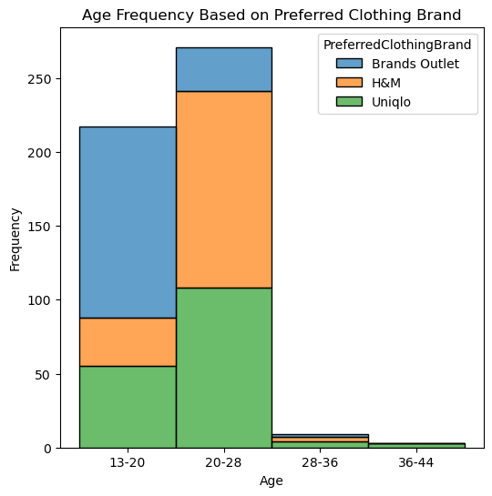
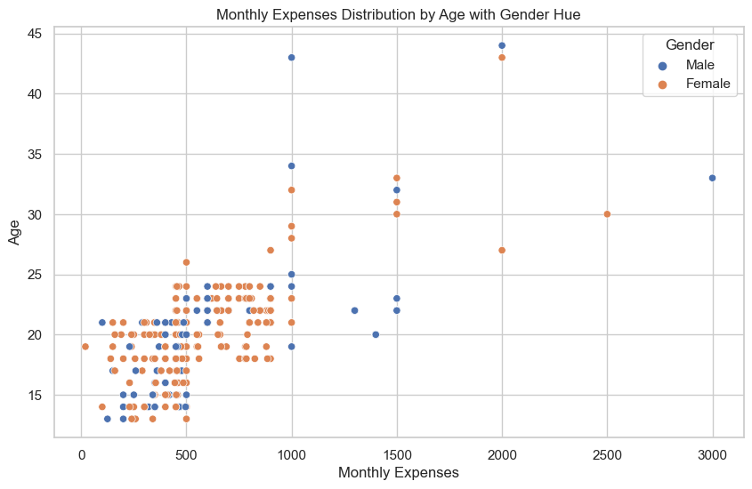
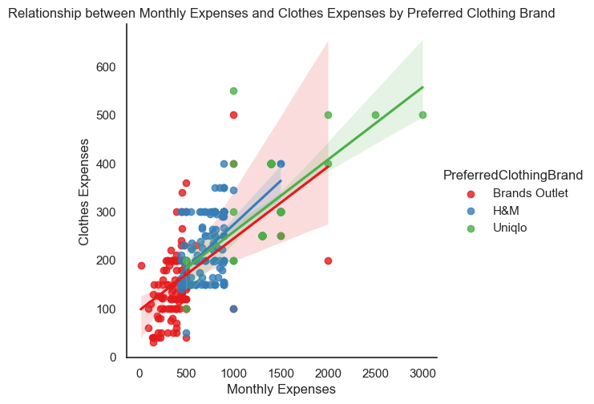
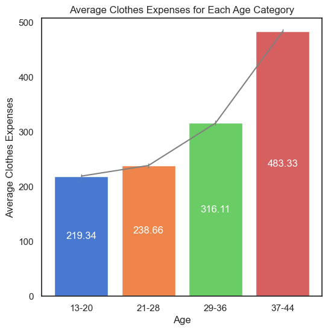
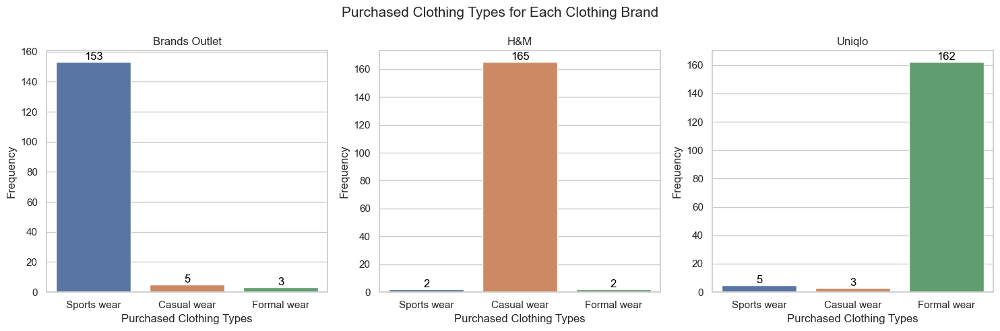
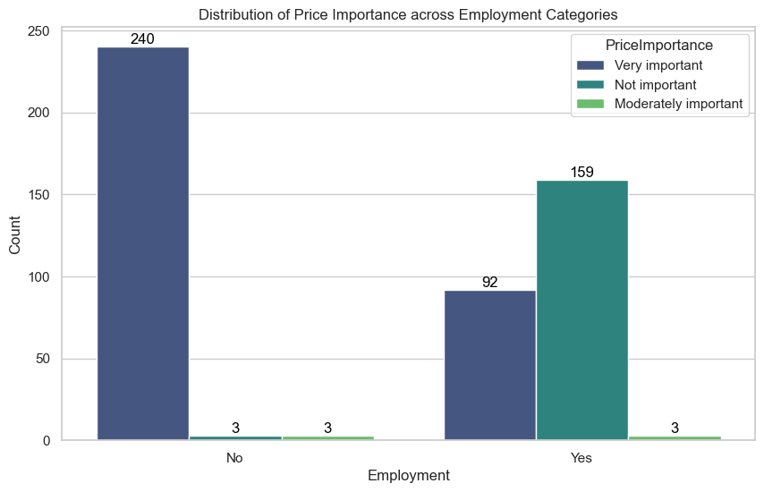
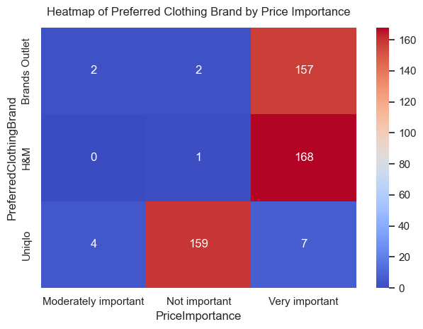
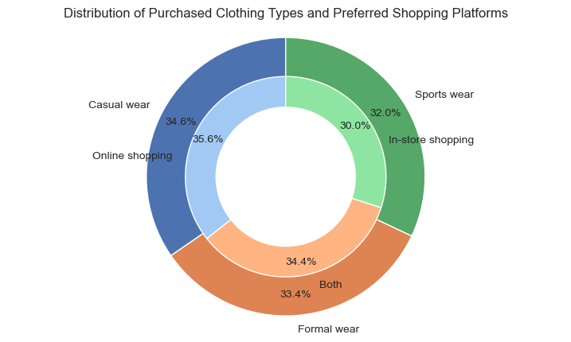

# 👕 Predictive Consumer Preference Analysis for Clothing Brands in Malaysia

## 📌 Project Overview  
This project demonstrates how data science and machine learning can be applied to predict **consumer brand preferences** in Malaysia’s fashion retail market.  
It simulates a realistic decision-making scenario where consumers choose among three mainstream brands: **H&M**, **Uniqlo**, and **Brands Outlet**.

We analyze the impact of factors like:
- **Price Sensitivity** 💰
- **Perceived Quality** 🏆
- **Fashion Style** 👗
- **Brand Image & Identity** 🏢

> 🎯 *This simulation mirrors the logic used in centralized e-commerce platforms (e.g., Zalora), where user attributes and preferences drive intelligent brand or product recommendations.*

---

## 1️⃣ Data Preparation & Exploration

### 📊 Data Collection  
A synthetic dataset was created to mimic real consumer survey responses.  
It includes:
- Demographic info: `age`, `gender`, `employment`, `monthly income`, `clothes spending`
- Shopping behavior: preferences for `style`, `brand image`, `price`, and `quality`
- Purchase channel: online vs in-store  
- Clothing type preference

### 🧹 Data Cleaning  
Handled missing values, outliers, and inconsistent input in [Data Cleaning.ipynb](notebooks/Data%20Cleaning.ipynb).  
📂 Final output: [Cleaned Dataset.csv](data/Cleaned%20Dataset.csv)

### 📉 Exploratory Data Analysis (EDA)  
Performed in [Data Analysis.ipynb](notebooks/Data%20Analysis.ipynb).  
The aim was to extract **consumer segments**, uncover **market trends**, and align **brand identity** with consumer expectations.

---

### 📊 Insights from Data Visualization

#### 👥 Age vs Brand Preference  
<p align="center">
  
</p>

**Observations:**
- **Brands Outlet** leads among teens (13–20), suggesting affordability and sportier appeal.
- **H&M** is the favorite among young adults (20–28), indicating its alignment with trending street fashion.
- **Uniqlo** sees broad appeal but especially among working-age consumers, reflecting its formal and minimalist image.

> 🔍 Each brand appeals to a distinct demographic. Retailers can align age-focused promotions by brand — e.g., TikTok ads for Brands Outlet, career-wear campaigns for Uniqlo.

---

#### 💵 Monthly Expenses by Age & Gender  
<p align="center">
  
</p>

- The **core spending group** is aged **15–25**, with monthly budgets between **RM300–RM1000**.
- Spending is **comparable between males and females**, highlighting gender-neutral targeting opportunities.
- Few older users (30+) show higher spending (RM1500+), but make up a smaller portion of the market.

> 🧠 Brands should focus on **value-for-money** propositions for youth while offering **premium options** for older, niche segments. Balanced male-female trends support unisex collections and cross-gender ad creatives.

---

#### 🧾 Clothes Spending vs Monthly Income by Brand  
<p align="center">
  
</p>

- Clear **positive correlation**: Higher earners spend more on clothing.
- **Uniqlo** customers are typically higher-income, spending more on fewer, high-quality items.
- **Brands Outlet** customers are budget-conscious, seeking value deals.

> 🔍 Pricing and quality positioning are crucial levers. Uniqlo’s premium perception resonates with higher-income earners — ideal for bundling, exclusives, or membership tiers.

---

#### 📈 Avg Clothing Spend by Age Group  
<p align="center">
  
</p>

- Clothing expenditure increases with age, peaking at **RM483.33** in the **37–44** group.  
- Youths (13–20) spend less due to **financial dependency**.  
- **Working adults (25–40)** represent the ideal middle ground with both intent and ability to spend.  

> 🧠 Mid-aged consumers, especially those between 25–44, offer the **highest return on marketing investment**, as they combine high disposable income with active fashion interest.

---

#### 👗 Clothing Type vs Brand  
<p align="center">
  
</p>

- **Brands Outlet** = **sportswear**
- **H&M** = **casual fashion**
- **Uniqlo** = **formal/business casual**

> 🔍 Clothing types strongly reflect each brand's **core identity**, validating brand segmentation. Useful for cross-brand upselling or tailored campaign themes.

---

#### 💵 Price Importance vs Employment  
<p align="center">
  
</p>

- **Unemployed** individuals rate price as **very important**.
- **Employed** consumers are more flexible, giving space to consider quality or brand image.

> 🧠 This insight supports **tiered product strategies** — budget lines for students and value-premium tiers for working professionals.

---

#### 🔥 Heatmap: Brand vs Price Sensitivity  
<p align="center">
  
</p>

- **H&M** and **Brands Outlet** attract **highly price-sensitive** shoppers.
- **Uniqlo** customers prioritize **image and quality**, less impacted by cost.

> 🔍 Promotional efforts should match pricing mindset — e.g., flash sales for H&M/Brands Outlet and loyalty programs for Uniqlo.

---

#### 🛍️ Preferred Shopping Channel vs Clothing Type  
<p align="center">
  
</p>

- **Online shoppers** tend to buy **casual wear**.
- **In-store** buyers prefer **sportswear**, which may need trial/fit.

> 🧠 Retailers can fine-tune **channel-specific inventory** — online-first for casual styles, in-store focus for fit-sensitive categories.

---

## 2️⃣ Predictive Modeling

### 🤖 Model: K-Nearest Neighbors (KNN)

Built to classify **brand preference** using:
- **Input Features**: Age, Gender, Income, Style & Quality Preferences
- **Output**: One of `H&M`, `Uniqlo`, or `Brands Outlet`

---

### 🔁 Why K-Fold Cross-Validation?

K-Fold Cross-Validation was used to:
- Ensure **reliable model performance**
- Minimize bias from a single train/test split
- Detect overfitting across **multiple random partitions**

With **5-Fold Cross-Validation**, the dataset was split into 5 equal parts:
- 4 parts used for training
- 1 part used for testing
- The process repeats 5 times with different test sets
- Final accuracy is the **average** of all runs

> ✅ This approach enhances **generalization** and gives a better estimate of real-world performance.

---

### 🔧 Hyperparameter Tuning  
Conducted in [Model Experiment.ipynb](notebooks/Model%20Experiment.ipynb):  
- Distance metric: `p = 1` (Manhattan) vs `p = 2` (Euclidean)  
- Neighbors: `n_neighbors` from 1–10

---

### ✅ Best Model Configuration  
From [K-Fold Experiment Result.csv](data/K-Fold%20Experiment%20Result.csv):
- **Best Parameters**: `p = 1`, `n_neighbors = 4`
- **Training Accuracy**: 95.75%
- **Testing Accuracy**: 94.2%
- **Standard Deviation**: 1.35

> ✅ **High accuracy + low variance** = robust model  
> ✅ Small gap between train/test = **no overfitting**  
> ✅ Consistent performance = reliable for real application

---

### 🧾 Final Model Simulation  
Implemented in [Model Classification.ipynb](notebooks/Model%20Classification.ipynb).  
User can simulate prediction with manual input:

```python
new_data = encode_input(
    employment="No",
    age=23,
    gender="Female",
    monthly_expenses=900,
    clothes_expenses=300,
    price_importance="Very important",
    quality_importance="Moderately important",
    style_importance="Very important",
    brand_image_importance="Very important",
    location_importance="Very important",
    purchased_clothing="Casual wear",
    preferred_shopping="Online shopping"
)
```
---

### 🧪 Accepted values for manual input:

| Feature                  | Acceptable Values                                                  |
|--------------------------|--------------------------------------------------------------------|
| `employment`             | `"Yes"`, `"No"`                                                    |
| `gender`                 | `"Male"`, `"Female"`                                               |
| `age`                    | Integer (13–60)                                                    |
| `monthly_expenses`       | Integer (100–5000, RM)                                             |
| `clothes_expenses`       | Integer (50–2000, RM)                                              |
| `price_importance`       | `"Not important"`, `"Moderately important"`, `"Very important"`    |
| `quality_importance`     | Same as above                                                      |
| `style_importance`       | Same as above                                                      |
| `brand_image_importance` | Same as above                                                      |
| `location_importance`    | Same as above                                                      |
| `purchased_clothing`     | `"Sports wear"`, `"Casual wear"`, `"Formal wear"`                  |
| `preferred_shopping`     | `"In-store shopping"`, `"Online shopping"`, `"Both"`               |

---

## 📈 Final Results Summary

- ✅ **Training Accuracy**: 95.75%  
- ✅ **Testing Accuracy**: 94.2%  
- ✅ **Standard Deviation**: 1.35  
- ✅ **No overfitting**, good generalization

---

## 🎯 Project Objectives Achieved

- ✅ Built an end-to-end classification model  
- ✅ Simulated personalized recommendations  
- ✅ Applied cross-validation and tuning  
- ✅ Extracted actionable EDA insights for marketing  

---

## 🛍️ Simulating a Centralized Platform (e.g., Zalora)

> 🧠 This project simulates the core logic of centralized platforms that host multiple brands.

**How this mimics Zalora:**
- 👤 Users input simple demographic and preference data  
- 🤖 System predicts the most suitable brand  
- 🛍️ Retailer can offer dynamic brand suggestions or pre-filtered catalogues  
- 🎯 Enables hyper-targeted promotions based on inferred behavior  

---

## 🔮 Future Enhancements

- 📥 Use real-world transaction/browsing history for training  
- 🌐 Host interactive input using Streamlit / Flask  
- 📊 Scale to include more brands or product categories  

---
